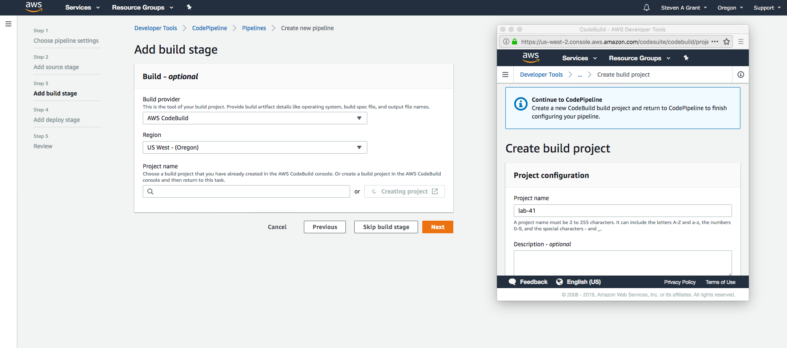

# php lab41
- deployment through AWS Codepipeline
- Authors: Trevor Dobson, Jack Daniel Kinne, Brandon Hurrington, Padmapriya Ganapathi.
- Challenge by: CodeFellows.

## Challenge
- Using only the instructions provided to you, implement a working CI/CD Pipeline
- Once you have it working …
- Add a “Build” stage to your Pipeline which includes the following steps (depending on your app)
- Build
- Test

## setup

Create Code pipleine.
### Step one:
create new service role

### Step two:
Setup github repo as the source.

### Step three:
- Choose repo

### Step four:
- Choose add build

- Deploy an Elastic beanstalk environment for PHP, selecting free teir options.
- Select Standard PHP low cost options.
- Select Amazon Linux 2 as the operating system.

### Step five:
Choose application.  We recommend you choose the sample application at first, to confirm deployment works.

### review
- Review your choices

### Success
You shoud now see a green pipeline.

## gotchas
- PROBLEM: in the buildspec.yml, ensure that PHP targets 7.2, as that is the latest version supported on the ENV for Elastic Beanstalk. DO NOT USE the class repo offering of the buildspec.yml file.
- SOLUTION: Ensure you are using an exact copy of the buildspec.yml included in this repo.

## credits and contributions
- Brandon Hurrington
- Padmapriya Ganapathi
- Trevor Dobson
- Steve Grant
- https://docs.aws.amazon.com/codebuild/latest/userguide/build-spec-ref.html#runtime-versions-buildspec-file

